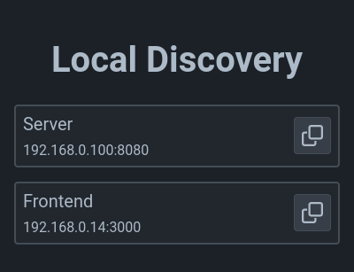

# Local Discovery

[](https://hub.docker.com/r/lucascorpion/local-discovery)
[](https://hub.docker.com/r/lucascorpion/local-discovery)
[](https://hub.docker.com/r/lucascorpion/local-discovery)

A simple service with a JSON API which can be used to discover agents in a local network.



## How Does it Work?

All endpoints only expose agents in the same network as the request origin, based on the remote client IP address.
That way you can never see or manipulate other agents than your own.

## API

### Agent Schema

| Attribute      | Description |
|----------------|-------------|
| `name`         | The name of the agent application.
| `localAddress` | The local address at which the agent is running.
| `info`         | A freeform object containing application-specific info about the agent.

### List the Agents

Send a `GET` request to `/api/agents`.
This returns a list of known agent information:

```json
[
  {
    "name": "agent",
    "localAddress": "192.168.0.110:4000",
    "info": {}
  }
]
```

### Register an Agent

Send a `POST` request to `/api/agents`, with the agent information in the request body:

```json
{
  "name": "agent",
  "localAddress": "192.168.0.110:4000",
  "info": {}
}
```

This returns the newly created agent.

**Note:** if the agent `name` and `localAddress` are the same as a known agent, the known agent will be replaced with the new one.

### Remove an Agent

Send a `DELETE` request to `/api/agents`, with the agent information in the request body:

```json
{
  "name": "agent",
  "localAddress": "192.168.0.110:4000"
}
```

This deletes the agent whose `name` and `localAddress` match this info.
If no such agent is found, nothing happens.
This returns an empty response.
